# CyberWomen Systems Architecture - Main Documentation
> Detailed Lab Setup, Manual Provisioning, and Automation Workflow

---

## Table of Contents

- [Introduction](#introduction)
- [Environment Setup](#environment-setup)
  - [Domain Controller Setup](#domain-controller-setup)
  - [Client VM Setup](#client-vm-setup)
  - [Network Configuration](#network-configuration)
- [Manual Provisioning](#manual-provisioning)
  - [OU Creation](#ou-creation)
  - [User and Group Creation](#user-and-group-creation)
  - [Delegation & Least Privilege](#delegation--least-privilege)
  - [Password Reset Workflow](#password-reset-workflow)
  - [Domain Join & RSAT Validation](#domain-join--rsat-validation)
- [Group Policy Administration](#group-policy-administration)
  - [Password Policies](#password-policies)
  - [Account Lockout Policies](#account-lockout-policies)
- [Automation Workflow](#automation-workflow)
  - [Script A: OU and Group Creation](#script-a-ou-and-group-creation)
  - [Script B: Bulk User Provisioning](#script-b-bulk-user-provisioning)
  - [Data Normalization & CSV Handling](#data-normalization--csv-handling)
  - [Shared Folder & Guest Additions](#shared-folder--guest-additions)
  - [Post-Deployment Audit](#post-deployment-audit)
- [Workstation Logon Restrictions](#workstation-logon-restrictions)
- [Screenshots](#screenshots)

---

## Introduction

This document provides a **step-by-step technical account** of building the **CyberWomen Active Directory Lab**, including:

- Manual provisioning of OUs, users, and groups
- Delegation and least-privilege validation
- Client domain joining and RSAT administration
- PowerShell automation for bulk provisioning
- Data normalization and pipeline setup
- Group Policy implementation and testing
- Post-deployment auditing of identities and group memberships

> Designed as **portfolio-ready documentation**, demonstrating enterprise-grade IAM and AD administration skills.

---

## Environment Setup

### Domain Controller Setup

1. Installed **Windows Server 2022** as the Domain Controller (DC).  
2. Promoted the server to **Active Directory Domain Services (AD DS)**.  
3. Configured **DNS** for domain resolution.  
4. Set a **static IP address** for domain stability (e.g., `10.0.2.11`).  
5. Installed necessary **GPOs** to support password policies and delegation.  

<!-- Screenshot placeholder: DC IP configuration -->
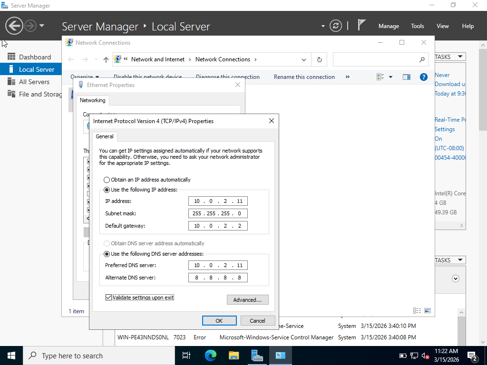

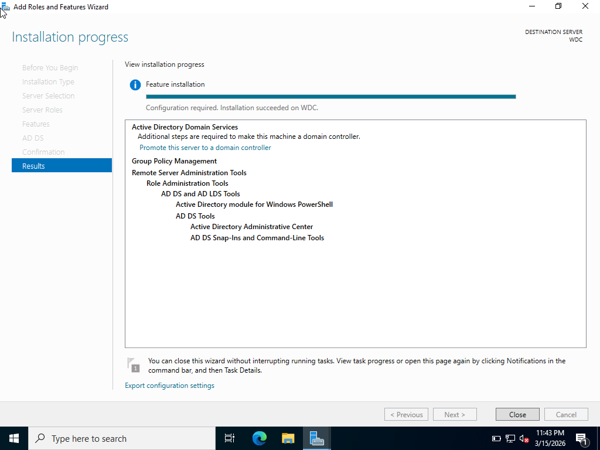

---

### Client VM Setup

1. Installed a **Windows 11 Pro client VM**.  
2. Joined the client to the same **NAT network** as the DC.  
3. Configured DNS on the client to point to the DC’s static IP.  
4. Domain joined the client via **System → Advanced Settings → Computer Name → Change → Domain**.
5. Client was placed into Computers container by default
6. Moved client object into **Managed Computers OU → Admin-Workstations**.  

<!-- Screenshot placeholder: Domain join -->
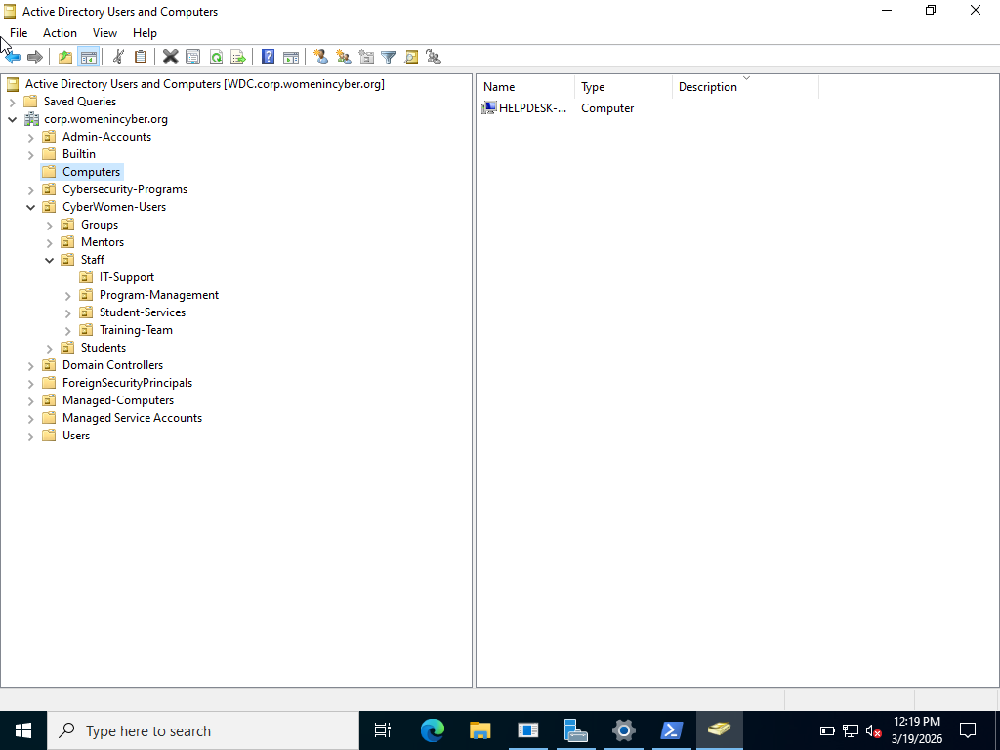

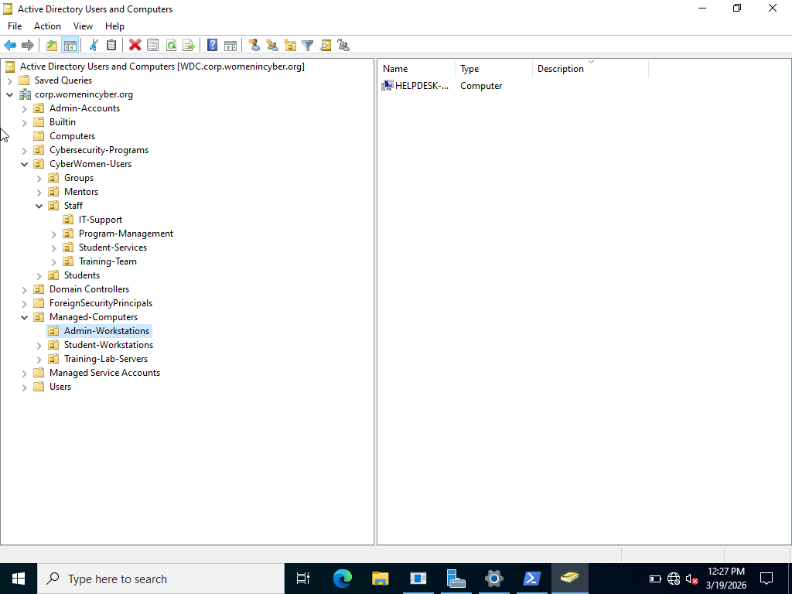

---

### Network Configuration

- **NAT network** ensures connectivity between host, DC, and client VMs.  
- Static IP addresses guarantee **DNS reliability and consistent AD authentication**.  

---

## Manual Provisioning

### OU Creation

- **CyberWomen-Users**  
  - Students → Cohort-2026, Cohort-2027, Alumni  
  - Mentors  
  - Staff → Program Management, Training Team, Student Services, IT Support  
- **Managed-Computers**  
  - Student Workstations  
  - Training Lab Servers  
  - Admin Workstations  
- **Cybersecurity-Programs**  
  - Red-Team, Blue-Team, GRC  
- **Admin-Accounts**  
  - Tier0, Tier1, Tier2  

> All OUs were **manually created** before automation to reflect realistic enterprise design.

<!-- Screenshot placeholder: OU structure -->
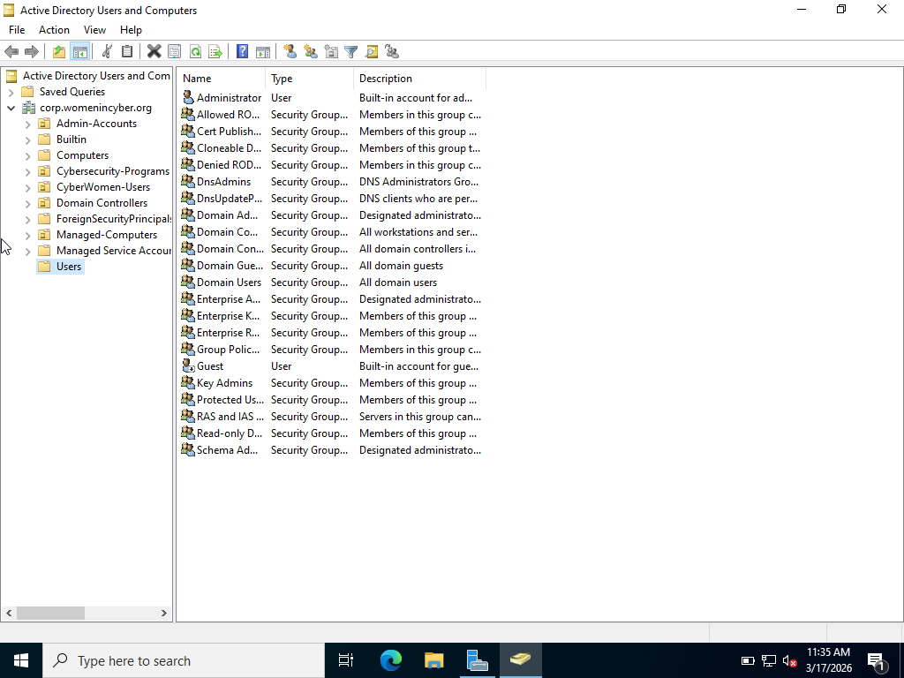

---

### User and Group Creation

- Users created manually:  
  - Tariro Nesu, Mike Karl , `Rest@go2026` (Mentor), `Create@f2026` (Admin), Nyasha Wayne (helpdesk), `Farai@nesu2026` (IT Support)  
- Groups created manually inside the **Groups OU** to enforce **RBAC**:  
  - Cohort groups (`GG-Cohort-2026`,`GG-Cohort-2027`)  

> Demonstrates **manual foundational understanding** before introducing automation.

<!-- Screenshot placeholder: Group creation -->
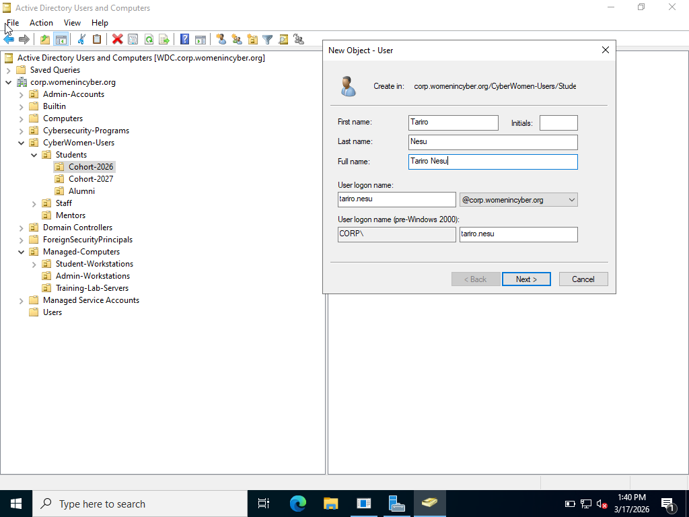
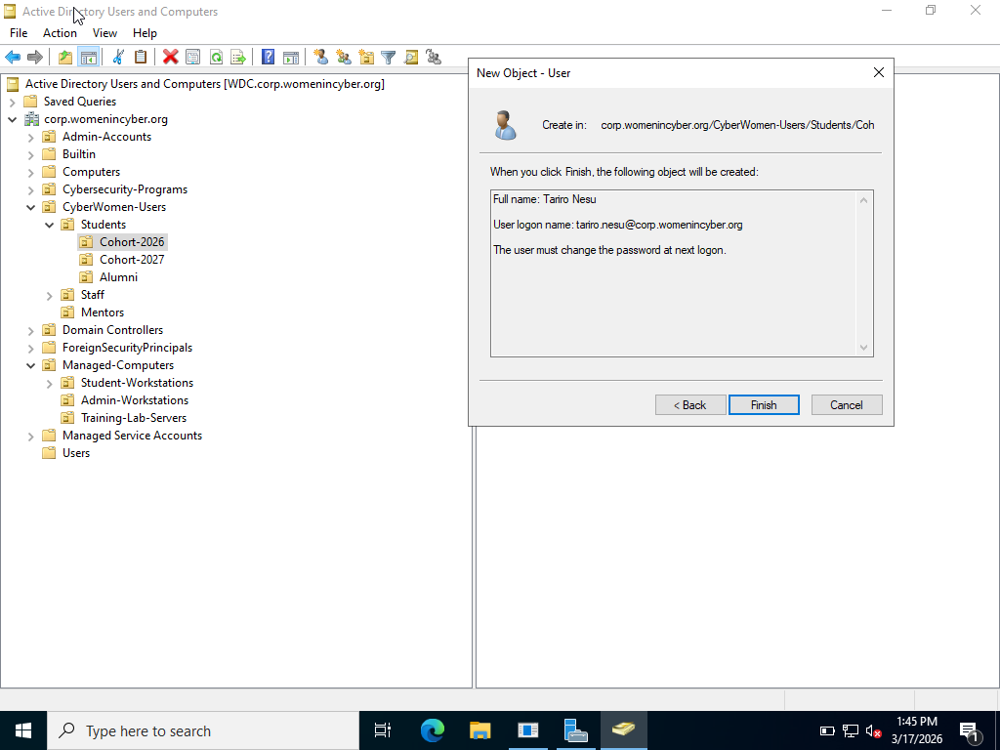
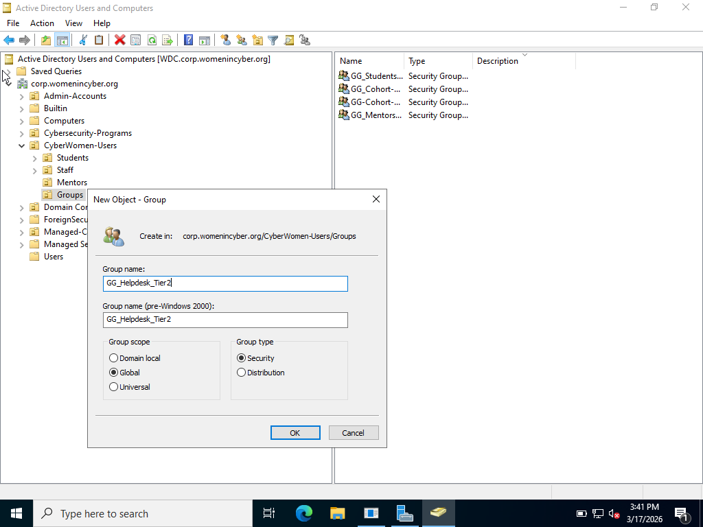

---

### Delegation & Least Privilege

1. **Helpdesk account (Tier2)** delegated permissions to **reset passwords only**.  
2. Tested delegation by signing in as helpdesk:  
   - Reset student password ✅  
   - Attempt to disable user ❌ (Access Denied)  
3. **Principle validated:** Tiered admin + least privilege enforced.

---

<!-- Screenshot placeholder: Password reset -->
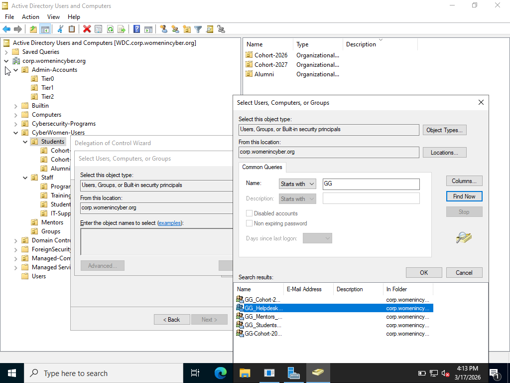
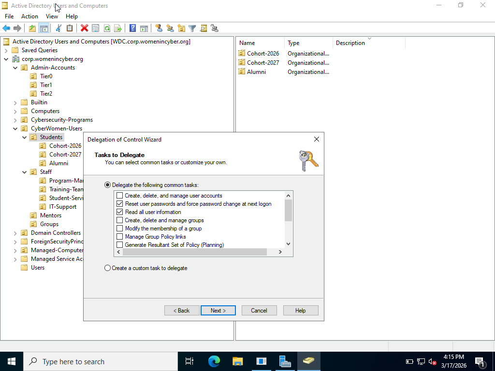
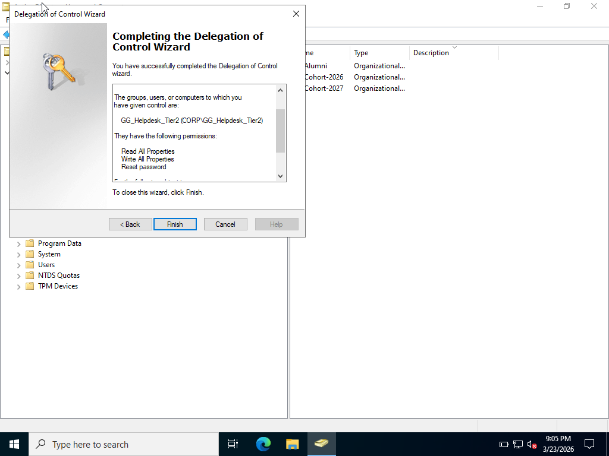

### Password Reset Workflow

- Password reset test:  
  > "Helpdesk account successfully changed a student's password at first logon."  
- Security control observed:  
  > "Interactive sign-in to the Domain Controller blocked for helpdesk account, consistent with Tiered Admin Model."  
- Correct workflow:  
  > "Helpdesk performs resets from domain-joined client using RSAT (ADUC), not from the DC."

---

### Domain Join & RSAT Validation

- Joined Windows 11 Pro client to domain.  
- Installed **RSAT** for administrative tasks.  
- Verified delegated permissions: helpdesk account can reset passwords but cannot perform unauthorized actions.  

---

## Group Policy Administration

### Password Policies

- Minimum password length: 12 characters  
- Complexity enforced  
- Password history: 24 remembered passwords  
- GPO applied to Students OU

### Account Lockout Policies

- Max failed login attempts: 5  
- Lockout duration: 15 minutes  
- Tested lockout → Helpdesk successfully reset password and unlocked account  

<!-- Screenshot placeholder: GPO enforcement -->

---

## Automation Workflow

### Script A: OU and Group Creation

- Automated creation of **Cybersecurity-Programs OUs** and **security groups**.  
- Issue observed: Some groups created in default `Users` container due to missing `-GroupScope`/`-GroupCategory` parameters.  
- Fix: Moved manually into the correct OU.

<!-- Screenshot placeholder: Script A log -->

---

### Script B: Bulk User Provisioning

- Imported **CSV file** for 100 students.  
- Created users in **Cohort OUs**.  
- Assigned users to cohort and program track groups.  
- Logging enabled for **audit and troubleshooting**.  

---

### Data Normalization & CSV Handling

- Cleared duplicate entries, fixed naming mismatches, and standardized usernames.  
- Adjusted CSV delimiter (`;`) due to Excel regional settings.  
- Verified all users correctly mapped to cohort and program track groups.

---

### Shared Folder & Guest Additions

- Installed **VirtualBox Guest Additions** for clipboard sharing and smooth admin workflow.  
- Created **persistent shared folder (Z:)** for PowerShell scripts and CSV ingestion.  
- Auto-mounted on VM boot, ensuring repeatable, scalable onboarding.

<!-- Screenshot placeholder: Shared folder -->

---

### Post-Deployment Audit

- Cohort groups reflect correct memberships (50 automated + 1 manual).  
- Program tracks verified (100 members total).  
- StudentID used to resolve duplicates.  
- All automated tasks confirmed successful.

<!-- Screenshot placeholder: Audit log -->

---

## Workstation Logon Restrictions

- Domain-joined client currently allows domain authentication.  
- Future Group Policy implementations can enforce **role-based workstation logon restrictions**.  

---

## Screenshots

- OU Structure: `top-level-ous-creation.png`  
- Group Creation: `group-creation.png`  
- Password Reset: `password-reset.png`  
- Domain Join: `domain-join.png`  
- GPO Enforcement: `gpo-password-policy.png`  
- Script Logs: `script-a-log.png`  
- Shared Folder: `shared-folder.png`  
- Post-Deployment Audit: `post-deployment-audit.png`  
